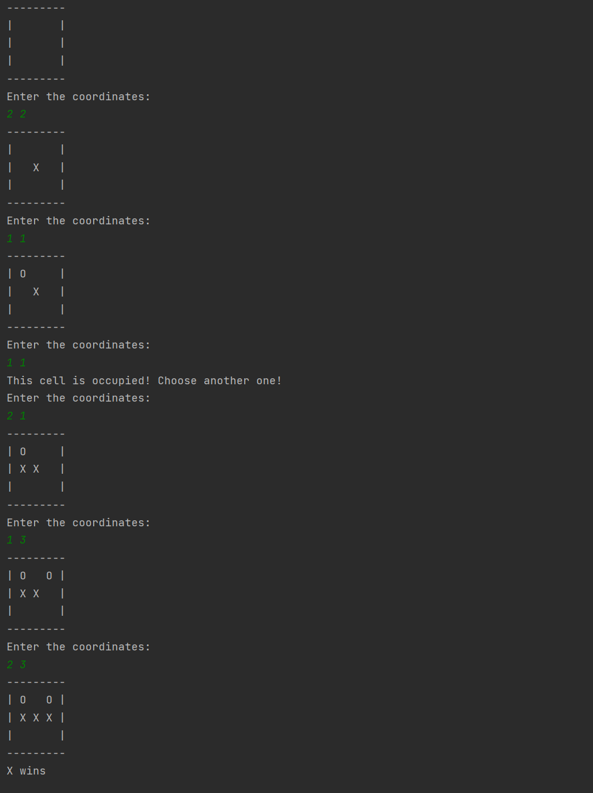

# Simple Tic-Tac-Toe 

## My second project on the Java Developer Track.

JetBrains Academy - [Java Developer](https://hyperskill.org/tracks/1?_gl=1%2a14b1fyh%2a_ga%2aNDQ1NzEzOTg3LjE2MjU0Mjk1NzQ.%2a_ga_V0XZL7QHEB%2aMTYyNTQyOTU3My4xLjEuMTYyNTQyOTU4MS4w&_ga=2.12843447.1835121274.1625429574-445713987.1625429574)

## Screenshot

## What I Learned
- Basic syntax of Java
- Variables
- Conditions
- Loops
- Methods
- User Input
- Multidimensional Arrays
- Iterating Arrays
- Logic
- Printing Data

